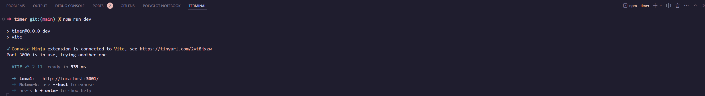

# React + TypeScript + Vite + Styled-components

## Timer

> Configuração básica para começar


### Instalando Git e Nodes

* git instalado (download)(https://git-scm.com/download/win)
* node instalado (download)(https://nodejs.org/en/download/package-manager)

### abra o projeto no VsCode e então abra o Terminal


## Iniciando o projeto

* rode os seguintes comandos

````shell
npm install
````
e logo depois

````shell
npm run dev
````



> pronto agora é só acessar (timer)(http://localhost:3000/) para ver a aplicação.